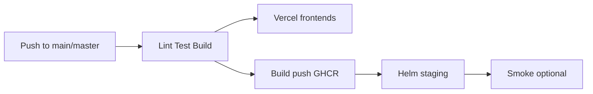

# Deployment Guide — Auvora Wallet

**Audience:** You, after the first GitHub push  
**Goal:** Automatic deploys on every push to `main` / `master`  
**Constraint:** Monorepo structure unchanged (Next.js apps + NestJS services)

---

## What this repo already provides

| Layer | How it deploys |
|-------|----------------|
| **Frontend** (`apps/web`, `apps/admin`, `apps/docs`) | Vercel (GitHub integration and/or Actions) |
| **Backend** (17 Nest services + gateway) | Docker → GHCR → Helm on Kubernetes |
| **CI** | `.github/workflows/ci.yml` — lint, typecheck, test, build |
| **CD** | `.github/workflows/cd.yml` — on every push to `main`/`master` |
| **Env templates** | `.env.example`, `.env.staging.example`, `.env.production.example` |

After secrets are configured once, **each push to `main`/`master` runs Continuous Deployment**.

---

## 0. Push the repository to GitHub

This workspace may not have `origin` yet. From the repo root:

```bash
git remote add origin https://github.com/<YOUR_ORG>/auvora-wallet.git
git push -u origin HEAD:main
```

Use `main` or `master` consistently — CD triggers on both.

Create GitHub Environments named **`staging`** and **`production`**  
(Settings → Environments). Add required reviewers on `production`.

---

## 1. Frontend — connect Vercel (required for UI auto-deploy)

Create **three** Vercel projects (or start with web only):

| Vercel project | Root Directory | Framework |
|----------------|----------------|-----------|
| auvora-web | `apps/web` | Next.js |
| auvora-admin | `apps/admin` | Next.js |
| auvora-docs | `apps/docs` | Next.js (optional) |

Each app has a `vercel.json` with monorepo `installCommand` / `buildCommand`.

### A. Recommended: Vercel ↔ GitHub integration

1. [vercel.com](https://vercel.com) → Add New Project → Import the GitHub repo.  
2. Set **Root Directory** to `apps/web` (repeat for admin/docs).  
3. Framework preset: **Next.js**.  
4. Enable **Production Branch** = `main` (or `master`).  
5. Add Environment Variables (Production + Preview) from `.env.example` — at minimum:

```text
NEXT_PUBLIC_API_URL=https://api.YOUR_DOMAIN
NEXT_PUBLIC_APP_URL=https://app.YOUR_DOMAIN
NEXT_PUBLIC_APP_NAME=Auvora Wallet
NEXT_PUBLIC_ADMIN_URL=https://admin.YOUR_DOMAIN
NEXT_PUBLIC_DOCS_URL=https://docs.YOUR_DOMAIN
NEXT_PUBLIC_STATUS_URL=https://app.YOUR_DOMAIN/status
NEXT_PUBLIC_MARKETING_URL=https://YOUR_DOMAIN
```

6. Deploy. Later pushes to the production branch deploy automatically via Vercel.

### B. Optional: GitHub Actions → Vercel (also in `cd.yml`)

Repo → Settings → Secrets and variables → Actions:

| Secret | Value |
|--------|--------|
| `VERCEL_TOKEN` | Vercel → Settings → Tokens |
| `VERCEL_ORG_ID` | Team / user id from `vercel project ls` or dashboard |
| `VERCEL_PROJECT_ID_WEB` | Project id for web |
| `VERCEL_PROJECT_ID_ADMIN` | Project id for admin |

If these are missing, CD **skips** Vercel steps and relies on the GitHub integration (A).

---

## 2. Backend — container registry + Kubernetes

### Images (automatic)

`cd.yml` and `build-images.yml` push to:

```text
ghcr.io/<OWNER>/<REPO>/<service>-service:<sha>
ghcr.io/<OWNER>/<REPO>/web|admin|docs:<sha>
```

Ensure **Packages** write permission for Actions (default `GITHUB_TOKEN` is enough with `packages: write` in the workflow).

Make packages public or grant the cluster pull access (imagePullSecrets).

### Kubernetes auto-deploy (staging on every push)

On the GitHub **`staging`** environment, add:

| Secret | Description |
|--------|-------------|
| `KUBE_CONFIG_DATA` | Base64-encoded kubeconfig (`base64 -w0 ~/.kube/config`) |
| `DATABASE_URL` | Optional — enables `prisma migrate deploy` before Helm |
| `STAGING_GATEWAY_URL` | Optional — e.g. `https://api.staging.YOUR_DOMAIN` for smoke checks |

CD then runs:

```text
helm upgrade --install auvora-staging … -f values-staging.yaml --set global.imageTag=$SHA
```

Without `KUBE_CONFIG_DATA`, CD still builds images and runs a **Helm dry-run** (safe rehearsal).

### Production Helm (gated — not every push)

1. Soak staging.  
2. Run **Promote Release** (`staging-verified`).  
3. Run **Deploy** with `environment=production`, `image_tag=<sha>`, `confirm_production=deploy-production`.  

Production environment secret: `KUBE_CONFIG_DATA` (prod cluster).

---

## 3. Backend without Kubernetes (optional hosts)

Structure stays the same. Point any Docker host at existing Dockerfiles:

```bash
# Example: gateway
docker build -f infrastructure/docker/Dockerfile.service \
  --build-arg SERVICE=gateway --build-arg PORT=4000 \
  -t auvora/gateway:latest .

# Example: Next web (if not using Vercel)
docker build -f infrastructure/docker/Dockerfile.next \
  --build-arg APP=web --build-arg PORT=3000 \
  -t auvora/web:latest .
```

Compatible platforms (configure via their Docker / compose UI):

- Railway / Render / Fly.io / ECS / Cloud Run — one service per Nest package  
- Set env from `.env.production.example`  
- Point `NEXT_PUBLIC_API_URL` on Vercel at your public gateway URL  

Do **not** run Nest services as Vercel serverless functions — they are long-lived Nest apps.

---

## 4. Database

```bash
# Against staging/production DATABASE_URL only:
pnpm install --frozen-lockfile
pnpm --filter @auvora/database-schema exec prisma migrate deploy
```

Or enable migrate in CD / Deploy via the `DATABASE_URL` secret.

Never use `migrate:dev` against production.

---

## 5. One-time checklist (do this once)

- [ ] Repo pushed to GitHub (`main` or `master`)  
- [ ] GitHub Environments: `staging`, `production`  
- [ ] Vercel projects linked (`apps/web`, optionally admin/docs) + `NEXT_PUBLIC_*` set  
- [ ] (Optional) `VERCEL_*` Action secrets  
- [ ] GHCR packages readable by the cluster  
- [ ] Staging kubeconfig → `KUBE_CONFIG_DATA`  
- [ ] Managed Postgres + Redis URLs in secrets  
- [ ] Alchemy / JWT / CSRF / SMTP secrets loaded  
- [ ] DNS + TLS for app / api / admin hosts  
- [ ] Push a commit to `main`/`master` and open **Actions → Continuous Deployment**  

---

## 6. What happens on every future push



| Job | Requires |
|-----|----------|
| Quality gates | Always |
| Vercel deploy | Integration and/or `VERCEL_*` secrets |
| GHCR images | Always (on CD) |
| Helm staging | `KUBE_CONFIG_DATA` on `staging` env |

Production cluster updates stay **manual + confirmed** (safer for wallets).

---

## 7. Local production build verification

```bash
pnpm install --frozen-lockfile
pnpm lint
pnpm test
pnpm build
```

UI preview (not production hosting):

```bash
pnpm preview:ui:clean
pnpm preview:health
```

---

## 8. Related docs

- [`docs/CI_CD_GUIDE.md`](./docs/CI_CD_GUIDE.md)  
- [`docs/PRODUCTION_DEPLOYMENT.md`](./docs/PRODUCTION_DEPLOYMENT.md)  
- [`docs/ENVIRONMENT_SETUP.md`](./docs/ENVIRONMENT_SETUP.md)  
- [`STAGING_DEPLOYMENT.md`](./STAGING_DEPLOYMENT.md)  
- [`.env.example`](./.env.example)  

---

## Troubleshooting

| Symptom | Fix |
|---------|-----|
| CD skips Vercel | Add GitHub↔Vercel integration or `VERCEL_*` secrets |
| CD skips Helm | Add `KUBE_CONFIG_DATA` to Environment `staging` |
| Next build fails on Vercel | Confirm Root Directory `apps/web` and pnpm 9 |
| Frontend calls wrong API | Rebuild with correct `NEXT_PUBLIC_API_URL` |
| Image pull errors | Auth cluster to `ghcr.io/<owner>/<repo>` |
| Migrate fails | Check `DATABASE_URL` and that migrations are committed |
