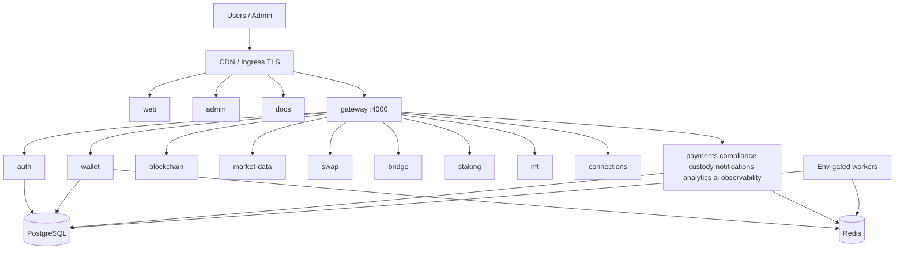

# Final Architecture — Auvora Wallet

**Task:** 037  
**Date:** 2026-07-27  
**Version:** `1.0.0-rc.1`  
**Companion:** [`docs/ARCHITECTURE.md`](./docs/ARCHITECTURE.md), ADR index

---

## System shape

Auvora Wallet is a **pnpm + Turborepo monorepo** with:

- **Next.js apps:** `web` (3000), `admin` (3001), `docs` (3011)  
- **NestJS hexagonal services** behind **gateway** (4000)  
- **Shared packages:** types, ui, sdk, database, security, secrets, cache, resilience, config  
- **Data:** PostgreSQL (Prisma) + Redis  
- **Deploy:** Docker images → GHCR → Helm (multi-host ingress) → optional Terraform stubs  

---

## Bounded contexts (services)

| Service | Port | Responsibility |
|---------|------|----------------|
| gateway | 4000 | Edge: proxy, rate limit, headers, Swagger, WSS entry |
| auth | 4001 | Identity, sessions, CSRF, RBAC |
| wallet | 3002 | Wallets, ledger, portfolio engine, sync workers |
| blockchain | 3003 | Multi-chain RPC (Alchemy), fees, confirmations |
| payments | 3004 | Fiat rails / payment ops |
| compliance | 3005 | KYC/AML style workflows |
| notifications | 3006 | Channels, queues, webhooks |
| analytics | 3007 | Product analytics |
| ai | 3008 | Assistant / knowledge |
| custody | 3009 | Keys, policies, signing approvals |
| observability | 3010 | Health, alerts, capacity surfaces |
| market-data | 3012 | Quotes, watchlists, portfolio intelligence |
| swap | 3013 | DEX aggregation / routing |
| nft | 3014 | Digital assets / gallery metadata |
| staking | 3015 | Staking / yield |
| connections | 3016 | External wallets / dApp connectivity |
| bridge | 3017 | Cross-chain transfers |

Workers run **in-process**, gated by `*_WORKERS_ENABLED` (and related flags).

---

## Frontend architecture

| App | Role |
|-----|------|
| web | Consumer wallet UX — dashboard, wallets, trading, NFT, Web3, settings, status |
| admin | Operator console — domain admin + observability + infrastructure pages |
| docs | Documentation site |

Shared design system: `@auvora/ui` (tokens, ThemeProvider, FeedbackStates, layouts).  
API access: `@auvora/sdk` via `NEXT_PUBLIC_API_URL` (no hardcoded production hosts).

---

## Cross-cutting packages

| Package | Role |
|---------|------|
| `@auvora/security` | Headers, CSP recommended string, cookie names, timing-safe helpers |
| `@auvora/database` | Prisma Nest module |
| `@auvora/secrets` | Secrets provider factory |
| `@auvora/cache` | Read-through cache helpers |
| `@auvora/resilience` | Timeout / retry / circuit breaker |

---

## Data & integrity

- **Prisma** schema owns models, FKs, indexes across auth → web3 domains  
- **Migrations** under `database/prisma/migrations/`  
- Production migrate: `prisma migrate deploy` (Deploy workflow opt-in)  
- Pooling via URL params / PgBouncer (documented)

---

## Edge & domains

Production hosts (env/Helm driven):

- `example.com` / `www` → web  
- `app.example.com` → web  
- `api.example.com` → gateway  
- `admin.example.com` → admin  
- `docs.example.com` → docs  
- `status.example.com` → web status surface  

TLS: cert-manager + HSTS at ingress. Cookies: `COOKIE_SECURE` + `COOKIE_DOMAIN`.

---

## Observability

- Pino structured logs with request/correlation IDs  
- OpenTelemetry bootstrap per service  
- Admin observability UI + `/metrics/resilience` (internal key)  
- Local OTEL collector compose for dev  

---

## CI/CD topology

1. CI — lint, typecheck, test, build  
2. Build/sign/scan images  
3. Promote (staging verified)  
4. Deploy (Helm) with smoke + rollback  
5. Infra validate (Terraform fmt/validate, Helm lint)  

---

## Architectural invariants (do not break)

1. No hardcoded production URLs in app source  
2. Hexagonal service boundaries preserved  
3. Gateway is the public API edge  
4. Secrets never committed — External Secrets / templates only  
5. Workers default safe (disabled or env-gated)  

---

## Evolution path (post-GA)

- httpOnly sessions + enforced CSP  
- Redis HA rate limiting  
- Live portfolio wiring (retire demo holdings)  
- Full auth web UX  
- Terraform modules from stubs → real providers  
- Expanded e2e + axe CI  

See [`TECHNICAL_DEBT.md`](./TECHNICAL_DEBT.md) and [`KNOWN_LIMITATIONS.md`](./KNOWN_LIMITATIONS.md).
