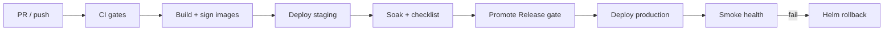

# CI/CD Guide — Auvora Wallet

**Task:** 036

---

## Workflow inventory

| Workflow              | File                       | Purpose                                                                       |
| --------------------- | -------------------------- | ----------------------------------------------------------------------------- |
| CI                    | `.github/workflows/ci.yml` | Lint, typecheck, test, build, artifact validation (`main`/`master`/`develop`) |
| Continuous Deployment | `cd.yml`                   | **Auto on push** to `main`/`master`: gates → Vercel → GHCR → Helm staging     |
| Infra validate        | `infra-validate.yml`       | Terraform + Helm lint                                                         |
| Build images          | `build-images.yml`         | GHCR images (17 services + web/admin/docs)                                    |
| Sign images           | `sign-images.yml`          | Cosign                                                                        |
| Image scan            | `image-scan.yml`           | Trivy                                                                         |
| Security scan         | `security-scan.yml`        | Audit, gitleaks, dependency review                                            |
| Release               | `release.yml`              | GitHub Release on `v*` tags                                                   |
| Promote               | `promote-release.yml`      | Staging soak gate before prod                                                 |
| Deploy                | `deploy.yml`               | Helm upgrade + smoke + rollback (manual / production)                         |

Operator setup after first GitHub push: **[`DEPLOYMENT.md`](../DEPLOYMENT.md)**.

## Pipeline stages



## Production deploy controls

1. `confirm_production` must equal `deploy-production` for production/DR
2. GitHub Environment protection rules (required reviewers) on `production`
3. Optional `run_migrations=true` runs `prisma migrate deploy` with `DATABASE_URL` secret
4. Failure triggers `helm rollback`
5. `helm history` recorded for rollback prep

## Artifact generation

- Nest `dist/` + Next `.next/standalone` (Docker multi-stage)
- Tags: `latest` + `${{ github.sha }}` on GHCR
- Helm chart under `infrastructure/helm/auvora-wallet`

## Rollback preparation

```bash
helm history auvora-production -n auvora-production
helm rollback auvora-production <REVISION> -n auvora-production
```

Blue/green: flip `global.blueGreen.activeSlot` without rebuilding.  
Canary: set weight then promote or abort.

## Local validation (no cluster)

```bash
bash infrastructure/scripts/validate-deployment-artifacts.sh
bash infrastructure/scripts/helm-lint.sh
```

## Secrets for Actions

| Secret             | Used by                    |
| ------------------ | -------------------------- |
| `KUBE_CONFIG_DATA` | Deploy (base64 kubeconfig) |
| `DATABASE_URL`     | Optional migrate step      |
| `GITHUB_TOKEN`     | GHCR push (automatic)      |

Without `KUBE_CONFIG_DATA`, Deploy performs **Helm dry-run** only (safe for CI rehearsal).
