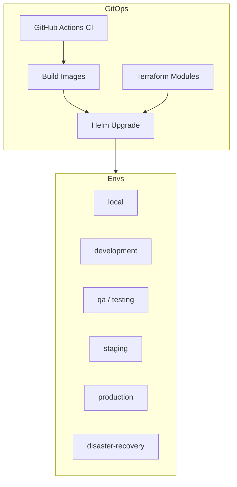

# Deployment Guide

Last updated: **2026-07-26** (Production Deployment Readiness)

## Architecture overview

Auvora Wallet deploys as a cloud-agnostic Kubernetes workload:

- **Edge:** Ingress → Gateway (`:4000`) + Web (`:3000`) + Admin (`:3001`)
- **Domain services:** Auth, Wallet, Blockchain, Payments, Compliance, Custody, Notifications, Analytics, AI, Observability
- **Data plane:** Postgres + Redis (managed via Terraform modules or in-cluster for local/dev)
- **GitOps-ready:** Helm umbrella chart + Kustomize overlays per environment

Diagrams:

- Environments: [`diagrams/deployment-environments.md`](./diagrams/deployment-environments.md)
- Networking: [`diagrams/networking-topology.md`](./diagrams/networking-topology.md)
- Service topology: [`diagrams/service-topology.md`](./diagrams/service-topology.md)
- Readiness checklist: [`PRODUCTION_READINESS_DEPLOYMENT.md`](./PRODUCTION_READINESS_DEPLOYMENT.md)



## Environments

| Environment       | Namespace                  | Values file                     | Secrets                   |
| ----------------- | -------------------------- | ------------------------------- | ------------------------- |
| local             | `auvora-local`             | `values-local.yaml`             | Chart Secret (local only) |
| development       | `auvora-development`       | `values-development.yaml`       | External Secrets          |
| qa                | `auvora-qa`                | `values-qa.yaml`                | External Secrets          |
| testing           | `auvora-testing`           | `values-testing.yaml`           | External Secrets          |
| staging           | `auvora-staging`           | `values-staging.yaml`           | External Secrets          |
| production        | `auvora-production`        | `values-production.yaml`        | External Secrets          |
| disaster-recovery | `auvora-disaster-recovery` | `values-disaster-recovery.yaml` | External Secrets          |

Each environment is isolated (namespace, secrets, config). No shared credentials across envs.

## Deployment strategies

Set `global.deploymentStrategy` (or Deploy workflow input):

| Strategy     | Cutover                                                                   |
| ------------ | ------------------------------------------------------------------------- |
| `rolling`    | Default Kubernetes RollingUpdate (`maxUnavailable: 0`)                    |
| `blue-green` | Deploy to `global.blueGreen.slot`; flip `activeSlot` to cut traffic       |
| `canary`     | Stable + `{service}-canary` Deployment/Service for progressive validation |

```bash
# Blue/green deploy into green slot (traffic stays on blue until flip)
helm upgrade --install auvora-production infrastructure/helm/auvora-wallet \
  -f infrastructure/helm/auvora-wallet/values-production.yaml \
  --namespace auvora-production \
  --set global.deploymentStrategy=blue-green \
  --set global.blueGreen.slot=green \
  --set global.blueGreen.activeSlot=blue

# Cut over
helm upgrade auvora-production infrastructure/helm/auvora-wallet \
  -f infrastructure/helm/auvora-wallet/values-production.yaml \
  --namespace auvora-production \
  --set global.deploymentStrategy=blue-green \
  --set global.blueGreen.slot=green \
  --set global.blueGreen.activeSlot=green
```

## Prerequisites

- Docker 24+
- kubectl + Helm 3.16+
- Terraform 1.9+ (optional for cloud resources)
- pnpm 9.15.9 / Node from `.nvmrc` for app builds
- External Secrets Operator (non-local environments)

## Local development

```bash
docker compose up -d
pnpm install
pnpm --filter @auvora/database-schema exec prisma migrate deploy
pnpm --filter @auvora/database-schema seed
pnpm dev
```

Optional in-cluster local stack:

```bash
helm upgrade --install auvora-local infrastructure/helm/auvora-wallet \
  -f infrastructure/helm/auvora-wallet/values-local.yaml \
  --namespace auvora-local --create-namespace
```

## Container builds

```bash
# Nest service
docker build -f infrastructure/docker/Dockerfile.service \
  --build-arg SERVICE=gateway --build-arg PORT=4000 \
  -t auvora/gateway-service:local .

# Next app
docker build -f infrastructure/docker/Dockerfile.next \
  --build-arg APP=web --build-arg PORT=3000 \
  -t auvora/web:local .
```

Or: `bash infrastructure/scripts/build-images.sh`

Images run as non-root (`USER auvora`), expose healthchecks, and pair with Kubernetes startup/liveness/readiness probes.

## Helm deploy / rollback

```bash
helm upgrade --install auvora-staging infrastructure/helm/auvora-wallet \
  -f infrastructure/helm/auvora-wallet/values-staging.yaml \
  --namespace auvora-staging --create-namespace \
  --set global.imageTag=$GIT_SHA

# Rollback
helm rollback auvora-staging --namespace auvora-staging
```

## Terraform

```bash
cd infrastructure/terraform
terraform init -backend=false
terraform validate
# Enable modules per env via terraform.tfvars (see envs/*) — never commit real .tfvars
```

## Secrets

| Backend                              | When                                                        |
| ------------------------------------ | ----------------------------------------------------------- |
| Chart Secret (`secrets.create=true`) | Local only (`values-local.yaml`)                            |
| External Secrets Operator            | Development → DR (default)                                  |
| `existingSecretName`                 | Pre-provisioned K8s Secret                                  |
| `@auvora/secrets`                    | Runtime provider abstraction (env / k8s / vault / cloud SM) |

Production values set `secrets.create: false`. Never commit real credentials.

## CI/CD workflows

| Workflow             | Purpose                                                                           |
| -------------------- | --------------------------------------------------------------------------------- |
| `ci.yml`             | lint, typecheck, test, build + deployment artifact validation + PR security gates |
| `security-scan.yml`  | dependency review, audit, gitleaks                                                |
| `build-images.yml`   | multi-service container build/push                                                |
| `sign-images.yml`    | Cosign signing                                                                    |
| `image-scan.yml`     | Trivy filesystem scan                                                             |
| `infra-validate.yml` | terraform validate, helm lint, kustomize                                          |
| `deploy.yml`         | manual Helm deploy (rolling/blue-green/canary) + rollback                         |
| `release.yml`        | tagged GitHub releases                                                            |

Validate locally:

```bash
bash infrastructure/scripts/validate-deployment-artifacts.sh
```

## Verification URLs (local)

- Web: http://localhost:3000
- Admin: http://localhost:3001 · Infra: http://localhost:3001/infrastructure
- API: http://localhost:4000
- Swagger: http://localhost:4000/api/docs
- Health: http://localhost:4000/health

See also: [`DISASTER_RECOVERY.md`](./DISASTER_RECOVERY.md), [`infrastructure/helm/README.md`](../infrastructure/helm/README.md), [`infrastructure/terraform/README.md`](../infrastructure/terraform/README.md).
