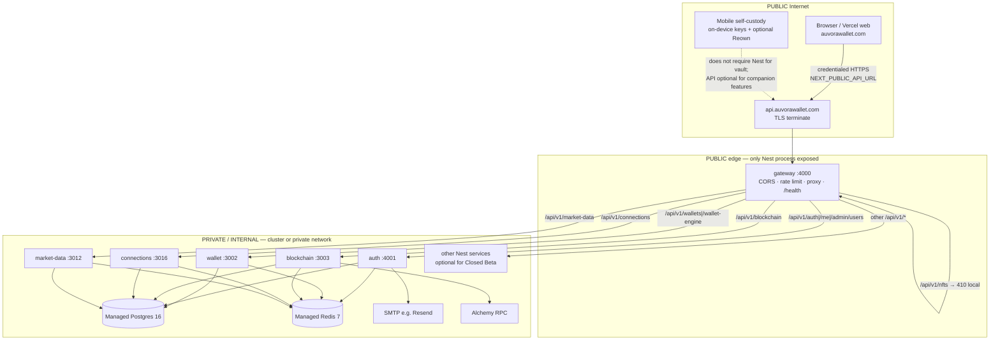

# Auvora — Production Backend Infrastructure Requirements

**Date:** 2026-08-03  
**Workspace:** `D:\auvora-wallet`  
**Scope:** Discovery + requirements for Closed Beta API mesh (Phases 1–15)  
**Constraints honored:** No deploy · No purchase · No DNS/Vercel domain changes · No Nest→serverless rewrite · Broadcast OFF · No commit/push

**Related:** [`DEPLOYMENT_CHECKLIST.md`](./DEPLOYMENT_CHECKLIST.md) · [`FINAL_PRODUCTION_READINESS_REPORT.md`](./FINAL_PRODUCTION_READINESS_REPORT.md) · [`KNOWN_LIMITATIONS.md`](./KNOWN_LIMITATIONS.md) · root [`DEPLOYMENT.md`](../DEPLOYMENT.md) · [`.env.production.example`](../.env.production.example)

---

## Executive posture

| Surface          | Host class                                     | Status                                         |
| ---------------- | ---------------------------------------------- | ---------------------------------------------- |
| Web (`apps/web`) | Vercel                                         | Apex `auvorawallet.com` VALID (user-confirmed) |
| Nest API mesh    | External Docker/container host (Helm optional) | **Not live** at `api.auvorawallet.com`         |
| Postgres         | Managed external                               | **Not attested**                               |
| Redis            | Managed external                               | **Not attested**                               |
| Live broadcast   | Kill-switched OFF                              | Confirmed                                      |

Architecture is already correct for Closed Beta: **Vercel web · public gateway · private Nest services · managed Postgres + Redis**. Kubernetes/Helm is **optional for Closed Beta**; keep the chart for scale.

---

## 1. Independently runnable backend services

All Nest packages share: `nest build` → `node dist/main.js`, `GET /health` (liveness) + `GET /ready` (readiness), multi-stage image via `infrastructure/docker/Dockerfile.service` (`SERVICE` + `PORT` build-args).

| Name            | Dir                      | Framework | Entry          | Port                   | Dockerfile                             | Health                                                     | Deps                                              | Key env NAMES (not values)                                                                                                                | Public?                                                       | Persistent storage                     |
| --------------- | ------------------------ | --------- | -------------- | ---------------------- | -------------------------------------- | ---------------------------------------------------------- | ------------------------------------------------- | ----------------------------------------------------------------------------------------------------------------------------------------- | ------------------------------------------------------------- | -------------------------------------- |
| **gateway**     | `services/gateway`       | NestJS 11 | `dist/main.js` | **4000**               | `Dockerfile.service` `SERVICE=gateway` | `/health`, `/ready` (auth upstream), `/metrics/resilience` | Optional DB/Redis; all `*_SERVICE_URL`            | `CORS_ORIGINS`, `*_SERVICE_URL`, `GATEWAY_RATE_LIMIT_*`, `PROXY_TIMEOUT_MS`, `INTERNAL_API_KEY`                                           | **PUBLIC**                                                    | None (stateless; in-memory rate limit) |
| **auth**        | `services/auth`          | NestJS 11 | `dist/main.js` | **4001** (`AUTH_PORT`) | `SERVICE=auth`                         | `/health`, `/ready`                                        | **Postgres + Redis** required; SMTP for prod mail | `DATABASE_URL`, `REDIS_URL`, `JWT_*`, `CSRF_SECRET`, `COOKIE_*`, `MAIL_*`, `SMTP_*`, `APP_PUBLIC_URL`, `CORS_ORIGINS`, `INTERNAL_API_KEY` | **INTERNAL**                                                  | Via Postgres (users/sessions/tokens)   |
| **wallet**      | `services/wallet`        | NestJS 11 | `dist/main.js` | **3002**               | `SERVICE=wallet`                       | `/health`, `/ready`                                        | Postgres + Redis; calls blockchain                | `DATABASE_URL`, `REDIS_URL`, `JWT_ACCESS_SECRET`, `CSRF_SECRET`, `WALLET_WORKERS_*`, `BLOCKCHAIN_SERVICE_URL`, `INTERNAL_API_KEY`         | **INTERNAL**                                                  | Postgres                               |
| **blockchain**  | `services/blockchain`    | NestJS 11 | `dist/main.js` | **3003**               | `SERVICE=blockchain`                   | `/health`, `/ready`, `/health/providers`                   | Postgres + Redis; Alchemy                         | `DATABASE_URL`, `REDIS_URL`, `ALCHEMY_*`, `BLOCKCHAIN_*`, `JWT_ACCESS_SECRET`, `CSRF_SECRET`                                              | **INTERNAL**                                                  | Postgres                               |
| **connections** | `services/connections`   | NestJS 11 | `dist/main.js` | **3016**               | `SERVICE=connections`                  | `/health`, `/ready`                                        | Postgres + Redis                                  | `DATABASE_URL`, `REDIS_URL`, `CONNECTIONS_*`, `JWT_ACCESS_SECRET`, `CSRF_SECRET`, `*_SERVICE_URL`                                         | **INTERNAL**                                                  | Postgres                               |
| payments        | `services/payments`      | NestJS 11 | `dist/main.js` | 3004                   | `SERVICE=payments`                     | `/health`, `/ready`                                        | Postgres + Redis                                  | `DATABASE_URL`, `REDIS_URL`, `PAYMENTS_*`, JWT/CSRF                                                                                       | INTERNAL                                                      | Postgres                               |
| compliance      | `services/compliance`    | NestJS 11 | `dist/main.js` | 3005                   | `SERVICE=compliance`                   | `/health`, `/ready`                                        | Postgres + Redis                                  | `DATABASE_URL`, `REDIS_URL`, `COMPLIANCE_*`, field encryption                                                                             | INTERNAL                                                      | Postgres                               |
| notifications   | `services/notifications` | NestJS 11 | `dist/main.js` | 3006                   | `SERVICE=notifications`                | `/health`, `/ready`                                        | Postgres + Redis                                  | `DATABASE_URL`, `REDIS_URL`, `NOTIFICATIONS_*`                                                                                            | INTERNAL                                                      | Postgres                               |
| analytics       | `services/analytics`     | NestJS 11 | `dist/main.js` | 3007                   | `SERVICE=analytics`                    | `/health`, `/ready`                                        | Postgres + Redis                                  | `DATABASE_URL`, `REDIS_URL`, `ANALYTICS_*`                                                                                                | INTERNAL                                                      | Postgres                               |
| ai              | `services/ai`            | NestJS 11 | `dist/main.js` | 3008                   | `SERVICE=ai`                           | `/health`, `/ready`                                        | Postgres + Redis                                  | `DATABASE_URL`, `REDIS_URL`, `AI_*` (simulators forbidden in prod)                                                                        | INTERNAL                                                      | Postgres                               |
| custody         | `services/custody`       | NestJS 11 | `dist/main.js` | 3009                   | `SERVICE=custody`                      | `/health`, `/ready`                                        | Postgres + Redis                                  | `DATABASE_URL`, `REDIS_URL`, `CUSTODY_*`                                                                                                  | INTERNAL                                                      | Postgres                               |
| observability   | `services/observability` | NestJS 11 | `dist/main.js` | 3010                   | `SERVICE=observability`                | `/health`, `/ready`                                        | Postgres + Redis                                  | `DATABASE_URL`, `REDIS_URL`, `OBSERVABILITY_*`                                                                                            | INTERNAL                                                      | Postgres                               |
| market-data     | `services/market-data`   | NestJS 11 | `dist/main.js` | 3012                   | `SERVICE=market-data`                  | `/health`, `/ready`                                        | Postgres + Redis; CoinGecko optional              | `DATABASE_URL`, `REDIS_URL`, `MARKET_DATA_*`, `COINGECKO_*`                                                                               | INTERNAL                                                      | Postgres                               |
| swap            | `services/swap`          | NestJS 11 | `dist/main.js` | 3013                   | `SERVICE=swap`                         | `/health`, `/ready`                                        | Postgres + Redis                                  | `DATABASE_URL`, `REDIS_URL`, `SWAP_*`                                                                                                     | INTERNAL                                                      | Postgres                               |
| nft             | `services/nft`           | NestJS 11 | `dist/main.js` | 3014                   | `SERVICE=nft`                          | `/health`, `/ready`                                        | Postgres + Redis                                  | `DATABASE_URL`, `REDIS_URL`, `NFT_*`                                                                                                      | INTERNAL — **disabled in prod Helm**; gateway returns **410** | Postgres (schema only)                 |
| staking         | `services/staking`       | NestJS 11 | `dist/main.js` | 3015                   | `SERVICE=staking`                      | `/health`, `/ready`                                        | Postgres + Redis                                  | `DATABASE_URL`, `REDIS_URL`, `STAKING_*`                                                                                                  | INTERNAL                                                      | Postgres                               |
| bridge          | `services/bridge`        | NestJS 11 | `dist/main.js` | 3017                   | `SERVICE=bridge`                       | `/health`, `/ready`                                        | Postgres + Redis                                  | `DATABASE_URL`, `REDIS_URL`, `BRIDGE_*`                                                                                                   | INTERNAL                                                      | Postgres                               |

**Total independently runnable Nest services: 17** (gateway + 16 domain services).

### Closed Beta minimum set (do not rewrite; selective enable)

| Priority                                       | Services                                                                                                                                                                                    |
| ---------------------------------------------- | ------------------------------------------------------------------------------------------------------------------------------------------------------------------------------------------- |
| **Required**                                   | `gateway`, `auth` + managed Postgres + Redis + SMTP                                                                                                                                         |
| **Strongly recommended** (web companion paths) | `wallet`, `blockchain`, `connections`, `market-data`                                                                                                                                        |
| **Defer / disable**                            | `nft` (already off + 410), `ai`, `payments`, `compliance`, `custody`, `swap`, `staking`, `bridge`, `analytics`, `observability`, `notifications` (auth can use `MAIL_DRIVER=smtp` directly) |

Missing upstreams do **not** prevent gateway boot; proxied routes return controlled **502/503** (`UPSTREAM_UNAVAILABLE` / `UPSTREAM_CIRCUIT_OPEN`).

---

## 2. Request flow (PUBLIC vs PRIVATE)



**Contract:** Prefer **gateway-only public**. Helm networkPolicy sets `allowFromIngress: true` only on gateway (and Next apps if co-hosted); domain services `allowFromGateway: true`, `allowFromIngress: false`. Match this on any non-K8s platform (private networking / no public ports on auth/wallet/…).

**Proxy prefixes (gateway):** auth, wallet, blockchain, payments, compliance, custody, notifications, analytics, ai, observability, market-data, swap, staking, connections, bridge; NFT handled locally as 410.

---

## 3. Postgres requirements

| Item            | Requirement                                                                                                                                                                                                                                                                                                |
| --------------- | ---------------------------------------------------------------------------------------------------------------------------------------------------------------------------------------------------------------------------------------------------------------------------------------------------------- |
| Version         | **PostgreSQL 16** (compose `postgres:16-alpine`; Helm optional chart same)                                                                                                                                                                                                                                 |
| ORM             | **Prisma 6.5** — `@auvora/database-schema` in `database/`                                                                                                                                                                                                                                                  |
| Migrations      | **22** under `database/prisma/migrations/`                                                                                                                                                                                                                                                                 |
| Extensions      | **`citext`** (`CREATE EXTENSION IF NOT EXISTS citext` in auth migration) — must be allowed on managed Postgres                                                                                                                                                                                             |
| Connection var  | **`DATABASE_URL`** (Prisma `env("DATABASE_URL")`)                                                                                                                                                                                                                                                          |
| Pooling         | App helper `withDatabaseUrlPool` / query params: `connection_limit`, `pool_timeout`, `connect_timeout`, `statement_cache_size`. Prod example uses `connection_limit=40&pool_timeout=10`. Prefer provider pooler (PgBouncer / Neon pooler / RDS Proxy) **in front of** app limits for multi-service fan-out |
| SSL             | Use provider TLS; append `sslmode=require` (or provider-equivalent) on `DATABASE_URL` when required — not hard-coded in schema                                                                                                                                                                             |
| Migrate command | `pnpm --filter @auvora/database-schema exec prisma migrate deploy` (**never** `migrate:dev` / **never** `migrate reset` on prod)                                                                                                                                                                           |
| Helm            | `postgres.enabled: false` in production values — **external managed DB**                                                                                                                                                                                                                                   |
| Backup          | Helm backup CronJob optional (`backup.cronJob` enabled in `values-production.yaml` schedule `0 2 * * *`) — still prefer **managed automated backups + PITR** on the DB host                                                                                                                                |
| Shared DB       | Single logical DB `auvora_wallet` shared across Nest services (one Prisma schema)                                                                                                                                                                                                                          |

**Do not create the production database in this discovery pass.**

---

## 4. Redis requirements

| Item                | Requirement                                                                                                                                                                                                                                                                                                                                            |
| ------------------- | ------------------------------------------------------------------------------------------------------------------------------------------------------------------------------------------------------------------------------------------------------------------------------------------------------------------------------------------------------ |
| Version             | **Redis 7** (compose `redis:7-alpine`)                                                                                                                                                                                                                                                                                                                 |
| Connection var      | **`REDIS_URL`** (`redis://` or `rediss://` for TLS)                                                                                                                                                                                                                                                                                                    |
| Auth                | Password in URL (`redis://:<secret>@host:6379`) — supported by **ioredis**                                                                                                                                                                                                                                                                             |
| TLS                 | Use `rediss://` for managed Redis TLS; ioredis accepts URL scheme                                                                                                                                                                                                                                                                                      |
| Helm                | `redis.enabled: false` in production — **external managed**                                                                                                                                                                                                                                                                                            |
| Uses                | **Auth:** login/mail rate limits (`ratelimit:*`); denylist helpers exist (`denylist:*`) but sessions/refresh revocation are **Postgres**. **Most services:** cache, workers, rate limits, health. **Gateway:** Redis optional; rate limit is **in-memory** (uneven across replicas — keep **1 gateway replica** for Closed Beta or accept soft limits) |
| Managed compatible? | **Yes** — standard Redis protocol + AUTH + optional TLS; no Redis Cluster / RedisJSON / Streams hard requirement found for Closed Beta auth path                                                                                                                                                                                                       |

---

## 5. Docker audit

| Check            | Status                                                                               |
| ---------------- | ------------------------------------------------------------------------------------ |
| Multi-stage      | Yes (`deps` → `build` → `runner`)                                                    |
| Base             | `node:22-alpine`                                                                     |
| Prod deps        | `pnpm install --frozen-lockfile`; runner copies `node_modules`                       |
| Non-root         | User `auvora`                                                                        |
| Healthcheck      | `wget` → `http://127.0.0.1:${PORT}/health`                                           |
| Ports            | `EXPOSE ${PORT}` via build-arg                                                       |
| Secrets in image | None baked — runtime env / secretRef only                                            |
| Shutdown         | Nest `enableShutdownHooks` + SIGTERM handlers (auth and peers)                       |
| Compose          | Local Postgres 16 + Redis 7 (+ Mailpit profile); app services commented              |
| Next image       | `Dockerfile.next` standalone; web preferably on **Vercel**, not required on API host |

### Fix applied this pass (no deploy)

`Dockerfile.service` previously omitted workspace member **`database/`** (`@auvora/database-schema`), which breaks `pnpm install --frozen-lockfile` and Prisma-backed service builds. Updated to:

- Copy `database/package.json` + `scripts/` in deps
- Copy full `database/` in build
- Run `prisma generate` for Linux engines before `turbo build`

Compose comment updated to match. **Local Docker CLI was not installed on this workstation** — image build not executed here; CI (`build-images.yml`) remains the intended verifier.

**Residual Docker notes (non-blocking for Closed Beta):**

- Runner copies full monorepo `node_modules` (image size large, not incorrect)
- Compose healthchecks for Postgres/Redis are solid; app profile still commented (intentional)
- Gateway in-memory rate limit ≠ Redis

**DOCKER verdict:** **PARTIAL** (defect fixed in tree; container build not proven on this host)

---

## 6. Helm audit — is K8s necessary for Closed Beta?

| Finding      | Detail                                                                                                                                         |
| ------------ | ---------------------------------------------------------------------------------------------------------------------------------------------- |
| Chart        | `infrastructure/helm/auvora-wallet` — Deployments, Services, Ingress, ConfigMap, ExternalSecret, optional Postgres/Redis, backup CronJob, RBAC |
| Prod values  | Hosts `*.auvorawallet.com`; `postgres/redis.enabled: false`; NFT disabled; ExternalSecrets; HPA defaults **minReplicas: 3** (heavy for beta)   |
| Non-K8s path | Documented in `DEPLOYMENT.md` §3 — same Dockerfiles on Railway / Render / Fly / ECS / Cloud Run                                                |

**Verdict:** Helm/K8s is **OPTIONAL FOR CLOSED BETA**. Same images and env contract run on a simpler managed container platform. **Keep Helm unchanged** for future scaling; do not rewrite chart for beta.

---

## 7. Closed Beta resource estimates (minimum)

Assumes selective service enable; single region; broadcast OFF.

| Component        | Replicas             | CPU request          | RAM request      | Storage                         |
| ---------------- | -------------------- | -------------------- | ---------------- | ------------------------------- |
| gateway          | **1** (in-memory RL) | 100–200m             | 256–512Mi        | ephemeral                       |
| auth             | 1                    | 100–200m             | 512Mi            | ephemeral                       |
| wallet           | 1                    | 100–200m             | 512Mi            | ephemeral                       |
| blockchain       | 1                    | 200m                 | 512Mi–1Gi        | ephemeral                       |
| connections      | 1                    | 100–200m             | 512Mi            | ephemeral                       |
| market-data      | 1 (optional)         | 100–200m             | 512Mi            | ephemeral                       |
| Managed Postgres | n/a                  | provider small       | ≥1–2 Gi RAM tier | **20–50 Gi** + automated backup |
| Managed Redis    | n/a                  | provider micro/small | ≥256–512 Mi      | persistence optional for beta   |

**Avoid** production Helm defaults (`hpa.minReplicas: 3`, 17 services × 2) until load justifies it — override replicas/`enabled` flags.

---

## 8. Hosting compatibility characteristics (no vendor pick)

Platform must provide:

1. **Long-lived containers** (not request-scoped serverless) for Nest
2. **Private networking** between gateway and domain services (or single private network)
3. **One public HTTPS endpoint** → gateway `:4000` (or platform TLS → container 4000)
4. **Env/secrets injection** at runtime (no bake into image)
5. **Outbound egress** to managed Postgres, Redis, SMTP, Alchemy, OTEL (if enabled)
6. **Health probes** preferring `/health` for restart; treat `/ready` carefully (many services return HTTP 200 with `status: Unhealthy` body — prefer custom probe logic or rely on `/health` + app metrics for beta)
7. **Image pull** from GHCR (or rebuild from `Dockerfile.service`)
8. **Multi-service deploy** (compose or N services) with stable DNS names matching `*_SERVICE_URL`
9. Compatible with **Node 22** runtime base

Optional later: Ingress + cert-manager + NetworkPolicy + ExternalSecrets (already in Helm).

---

## 9. `api.auvorawallet.com`

| Item             | Fact                                                                                                                                                                                                                                                           |
| ---------------- | -------------------------------------------------------------------------------------------------------------------------------------------------------------------------------------------------------------------------------------------------------------- |
| Target process   | **gateway** port **4000**                                                                                                                                                                                                                                      |
| DNS target type  | **A/AAAA or CNAME** to the **container platform / load balancer / ingress** that fronts gateway — **not** Vercel                                                                                                                                               |
| Current blocker  | Checklist: DNS still on Vercel-like IPs → Nest `/health` **404** — **API DOMAIN BLOCKED** until retarget (ops action; **this pass does not change DNS**)                                                                                                       |
| TLS              | Terminate at ingress/platform; app expects HTTPS clients (`COOKIE_SECURE=true`)                                                                                                                                                                                |
| CORS             | Gateway `CORS_ORIGINS` allowlist + credentials; prod: `https://auvorawallet.com`, `https://www.auvorawallet.com` (+ app/admin if used). Never `*`                                                                                                              |
| `APP_PUBLIC_URL` | `https://auvorawallet.com` — **web origin for email verify/reset links**, not the API host                                                                                                                                                                     |
| Cookies          | Prefer **host-only** on API host (`COOKIE_DOMAIN` empty). Refresh/CSRF httpOnly (CSRF readable); access often also in `sessionStorage` on web. Cross-site: `SameSite=Lax` + `Secure`; credentialed calls from apex → `api.*` work without shared Domain cookie |

---

## 10. Authoritative production env NAMES inventory

Names only — never commit values. Sources: `.env.production.example`, service `env.schema.ts`, Helm ExternalSecret keys, web `apps/web/src/env.ts`.

### WEB PUBLIC (`NEXT_PUBLIC_*` — Vercel)

| Name                             |
| -------------------------------- |
| `NEXT_PUBLIC_API_URL`            |
| `NEXT_PUBLIC_APP_URL`            |
| `NEXT_PUBLIC_APP_NAME`           |
| `NEXT_PUBLIC_ADMIN_URL`          |
| `NEXT_PUBLIC_DOCS_URL`           |
| `NEXT_PUBLIC_STATUS_URL`         |
| `NEXT_PUBLIC_MARKETING_URL`      |
| `NEXT_PUBLIC_CDN_ASSET_BASE_URL` |
| `NEXT_PUBLIC_WC_PROJECT_ID`      |

### WEB SERVER

None required for Closed Beta companion if all data goes through public API. **Never** put on Vercel: `DATABASE_URL`, `REDIS_URL`, `JWT_*`, `CSRF_SECRET`, `INTERNAL_API_KEY`, `ALCHEMY_*`, `SMTP_*`, Reown Secret.

### GATEWAY

`NODE_ENV`, `PORT`, `SERVICE_NAME`, `SERVICE_VERSION`, `LOG_LEVEL`, `CORS_ORIGINS`, `AUTH_SERVICE_URL`, `WALLET_SERVICE_URL`, `BLOCKCHAIN_SERVICE_URL`, `PAYMENTS_SERVICE_URL`, `COMPLIANCE_SERVICE_URL`, `CUSTODY_SERVICE_URL`, `NOTIFICATIONS_SERVICE_URL`, `ANALYTICS_SERVICE_URL`, `OBSERVABILITY_SERVICE_URL`, `AI_SERVICE_URL`, `MARKET_DATA_SERVICE_URL`, `SWAP_SERVICE_URL`, `NFT_SERVICE_URL`, `STAKING_SERVICE_URL`, `CONNECTIONS_SERVICE_URL`, `BRIDGE_SERVICE_URL`, `GATEWAY_RATE_LIMIT_MAX`, `GATEWAY_RATE_LIMIT_WINDOW_SECONDS`, `PROXY_TIMEOUT_MS`, `INTERNAL_API_KEY`, `OTEL_ENABLED`, `OTEL_EXPORTER_OTLP_ENDPOINT`, optional `DATABASE_URL` / `REDIS_URL`

### AUTH

`NODE_ENV`, `PORT` / `AUTH_PORT`, `DATABASE_URL`, `REDIS_URL`, `JWT_ACCESS_SECRET`, `JWT_REFRESH_SECRET`, `JWT_ACCESS_TTL_SECONDS`, `JWT_REFRESH_TTL_SECONDS`, `COOKIE_SECURE`, `COOKIE_DOMAIN`, `CSRF_SECRET`, `LOCKOUT_*`, `RATE_LIMIT_*`, `MAIL_RATE_LIMIT_*`, `MAIL_DRIVER`, `SMTP_HOST`, `SMTP_PORT`, `SMTP_USER`, `SMTP_PASS`, `SMTP_FROM`, `SMTP_FROM_NAME`, `APP_PUBLIC_URL`, `CORS_ORIGINS`, `AUTH_ALLOW_UNVERIFIED_LOGIN` (=false), `INTERNAL_API_KEY`, optional notifications/analytics/observability URLs, OTEL

### CONNECTIONS / BLOCKCHAIN / WALLET

Shared pattern: `DATABASE_URL`, `REDIS_URL`, `JWT_ACCESS_SECRET`, `CSRF_SECRET`, `INTERNAL_API_KEY`, `APP_PUBLIC_URL`, service-specific `*_WORKERS_*` / simulator flags (all simulators **false**), peer `*_SERVICE_URL`.

Blockchain extras: `BLOCKCHAIN_PRIMARY_PROVIDER`, `BLOCKCHAIN_SIMULATOR_ENABLED`, `ALCHEMY_API_KEY`, `ALCHEMY_*_RPC_URL`, `ALCHEMY_RPC_TIMEOUT_MS`, `ALCHEMY_REQUIRED`.

### DATABASE / REDIS

`DATABASE_URL`, `REDIS_URL` (and Helm-only `POSTGRES_PASSWORD` if in-cluster Postgres ever enabled — **not** for prod values).

### EMAIL

`MAIL_DRIVER`, `SMTP_HOST`, `SMTP_PORT`, `SMTP_USER`, `SMTP_PASS`, `SMTP_FROM`, `SMTP_FROM_NAME`, `MAIL_RATE_LIMIT_MAX`, `MAIL_RATE_LIMIT_WINDOW_SECONDS`

### REOWN

| Surface    | Name                        | Notes                                                       |
| ---------- | --------------------------- | ----------------------------------------------------------- |
| Web public | `NEXT_PUBLIC_WC_PROJECT_ID` | Project ID only — public OK                                 |
| Mobile     | `WC_PROJECT_ID` dart-define | Same Project ID                                             |
| Secret     | Reown Secret                | **Server-only if ever used** — not in web/mobile public env |

### ALCHEMY

`ALCHEMY_API_KEY`, `ALCHEMY_ETHEREUM_RPC_URL`, `ALCHEMY_POLYGON_RPC_URL`, `ALCHEMY_BSC_RPC_URL`, `ALCHEMY_SOLANA_RPC_URL`, `ALCHEMY_TRON_RPC_URL`, `ALCHEMY_BITCOIN_RPC_URL`, `ALCHEMY_RPC_TIMEOUT_MS`, `ALCHEMY_REQUIRED` — **blockchain service / secrets only**

### Duplicates / conflicts to watch

| Conflict                                        | Guidance                                                                                                                        |
| ----------------------------------------------- | ------------------------------------------------------------------------------------------------------------------------------- |
| Root `PORT=4000` vs auth                        | Auth prefers `AUTH_PORT`; set per-service `PORT` in container                                                                   |
| `CORS_ORIGINS` on gateway vs auth               | Both must allow web origins; auth also merges `APP_PUBLIC_URL`                                                                  |
| `COOKIE_DOMAIN` empty vs `.auvorawallet.com`    | Prefer empty (host-only on API)                                                                                                 |
| Helm ingress still lists web/admin/docs         | Prefer **Vercel** for those; do not dual-host without intent                                                                    |
| `values-production` CORS includes `app`/`admin` | Align with actual live hosts                                                                                                    |
| Simulator defaults                              | Several services default simulators true unless env set — **pin false** in prod ConfigMap (already in `values-production.yaml`) |

**PRODUCTION ENV INVENTORY:** **COMPLETE** (names catalogued; live values not provisioned)

---

## 11. Secret security

| Secret class                                             | Rule                                                                                 |
| -------------------------------------------------------- | ------------------------------------------------------------------------------------ |
| `JWT_ACCESS_SECRET`, `JWT_REFRESH_SECRET`, `CSRF_SECRET` | ≥32 chars; secrets manager / ExternalSecret; never images / git / `NEXT_PUBLIC_*`    |
| `INTERNAL_API_KEY`                                       | Service-to-service; rotate; protect metrics in prod                                  |
| SMTP user/pass                                           | Auth (or notifications) only                                                         |
| `ALCHEMY_API_KEY` / RPC URLs with embedded keys          | Blockchain service only                                                              |
| Object storage keys                                      | Server only                                                                          |
| Field encryption keys (`*_FIELD_ENCRYPTION_KEY`)         | Owning service only                                                                  |
| Reown Project ID                                         | Public OK                                                                            |
| Reown Secret                                             | Never mobile/web public                                                              |
| Logs                                                     | Pino redaction expanded; console mail redacts tokens — keep `LOG_LEVEL=warn` in prod |

**SECURITY (config posture):** **PASS** for Closed Beta design (device/prod mesh still unverified).

---

## 12. Safe first-prod DB sequence (document only — NEVER reset)

1. **Create** empty managed Postgres 16 database (provider UI/CLI) with a dedicated role
2. Enable **`citext`** (or confirm extensions allowlist)
3. Create credentials → store as `DATABASE_URL` in secrets manager (TLS params as required)
4. From a **one-off migrate job / CI step** with network to DB:  
   `pnpm --filter @auvora/database-schema exec prisma migrate status`
5. If pending and DB is the intended empty prod DB:  
   `pnpm --filter @auvora/database-schema exec prisma migrate deploy`
6. Re-run **migrate status** → all 22 applied
7. Smoke: auth `/ready` shows database healthy; optional non-destructive `SELECT 1`
8. **Never** `prisma migrate reset`, `db push --force-reset`, or drop/recreate after user data exists
9. Configure automated backups / PITR before inviting testers

---

## 13. Failure / resilience matrix

| Dependency down      | Behavior                                                                                                                                                                       |
| -------------------- | ------------------------------------------------------------------------------------------------------------------------------------------------------------------------------ |
| **Postgres**         | `/health` still OK (liveness); `/ready` body Unhealthy; auth/API writes fail with Nest errors — do not crash-loop solely on ready body HTTP code                               |
| **Redis**            | Ready Unhealthy; auth rate-limit paths fail/open; sessions still Postgres-backed                                                                                               |
| **Alchemy**          | Blockchain RPC errors / provider health degraded; boot fails if `ALCHEMY_REQUIRED` and missing creds in prod                                                                   |
| **Internal service** | Gateway proxy → **502** `UPSTREAM_UNAVAILABLE` or **503** circuit open — JSON error envelope                                                                                   |
| **SMTP**             | Register/resend/forgot that `await mail.send` will **fail the request** if transporter throws — controlled 5xx, not silent success; configure working SMTP before beta invites |
| **Gateway overload** | In-memory 429 `RATE_LIMITED`                                                                                                                                                   |

Broadcast remains **OFF** — fund-moving paths refuse live chain submission regardless of backend health.

---

## 14. Build validation (this pass)

| Check                                                                        | Result                                                        |
| ---------------------------------------------------------------------------- | ------------------------------------------------------------- |
| `@auvora/security` jest                                                      | **12 passed**                                                 |
| `@auvora/auth-service` targeted jest                                         | **26 passed**                                                 |
| `@auvora/gateway-service` jest                                               | **6 passed**                                                  |
| Typecheck gateway, auth, wallet, blockchain, connections, `@auvora/database` | **Exit 0**                                                    |
| Docker image build                                                           | **Not run** — Docker CLI absent on workstation                |
| Live `/health` on `api.auvorawallet.com`                                     | **Out of scope** (no deploy); known **BLOCKED** per checklist |

**BACKEND TESTS:** **PASS** (scoped suites)  
**CONTAINER BUILDS:** **PARTIAL** (Dockerfile fixed; not executed locally)

---

## 15. Architecture summary

```text
[Vercel] auvorawallet.com / www
        │  NEXT_PUBLIC_API_URL
        ▼
[PUBLIC TLS] api.auvorawallet.com ──► gateway:4000
                                        │
              ┌─────────────────────────┼─────────────────────────┐
              ▼                         ▼                         ▼
           auth:4001              wallet/blockchain/…        (optional services)
              │                         │
              └──────────┬──────────────┘
                         ▼
              managed Postgres 16 + Redis 7
                         +
              SMTP (Resend) · Alchemy (blockchain)
```

**Broadcast:** OFF · **Funding:** LOCKED · **NFT product:** ABSENT (410)

---

## Closed Beta platform decision

**YES** — current backend can run safely on a **managed Docker/container platform** without rewriting Nest or converting to Vercel serverless, provided the platform supplies: long-lived containers, private service networking, public HTTPS to gateway only, runtime secrets, managed Postgres 16 (+ citext) + Redis 7, and outbound SMTP/Alchemy.

Helm remains the scale path; not a Closed Beta blocker.

---

## Scorecard (discovery)

| Gate                         | Status                                    |
| ---------------------------- | ----------------------------------------- |
| Backend services inventoried | 17                                        |
| Public surface               | gateway only (intended)                   |
| Gateway code                 | READY (env/CORS/proxy)                    |
| Docker                       | PARTIAL (fix landed; build unproven here) |
| Helm                         | OPTIONAL FOR CLOSED BETA                  |
| Postgres / Redis             | Requirements clear; hosts not provisioned |
| API domain                   | BLOCKED (DNS not on gateway)              |
| Env inventory                | COMPLETE (names)                          |
| Security design              | PASS                                      |
| Broadcast                    | OFF                                       |
