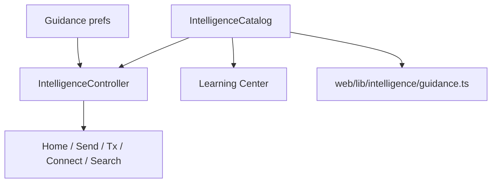

# Sprint 10 Implementation Report

## Summary

Sprint 10 ships **Auvora Intelligence™** as an on-device guidance layer — not a chatbot takeover. It explains fees, security prompts, portfolio changes, and network states in plain language, only when useful, never as investment advice.

## Locked decisions

- Intelligence is **contextual guidance**, not a primary chatbot product
- No buy/sell/price prediction / trade recommendations
- External AI **off by default**; wallet data stays on-device without explicit consent
- Instant local catalogs (no network round-trip for tips/lessons)
- Mobile parity for Learning Center, guidance prefs, search assist, and explain panels

## Architecture

### Mobile (`apps/mobile/lib/intelligence/`)

| Module                         | Role                                                                       |
| ------------------------------ | -------------------------------------------------------------------------- |
| `models.dart`                  | GuidanceLevel, explanations, lessons, search hits, prefs                   |
| `catalog.dart`                 | Lessons + transaction / security / network / fee explainers + search index |
| `portfolio_summaries.dart`     | Observational portfolio lines (never advice)                               |
| `intelligence_controller.dart` | Local prefs, dismissals, visibility rules                                  |

### Web (`apps/web/src/lib/intelligence/`)

| Module        | Role                                                   |
| ------------- | ------------------------------------------------------ |
| `guidance.ts` | Prefs, search assist, network explanations, disclaimer |

Existing Phase 7 `/learn`, `/insights`, and optional Q&A (`/assistant`) remain — reframed as Learning Center + Intelligence Q&A under the same principles.

## What shipped

### Transaction intelligence

- Pending / failed / completed / bridge / swap explanations (what / why / next)
- Fee estimate panels on Send and transaction detail (including elevated-fee copy)

### Security intelligence

- Connection approval explain panel (lookalike / unknown / standard)
- Signature explanation catalog entry
- Recovery / biometric lessons

### Portfolio intelligence

- Home “Portfolio note” summaries (growth driver, quiet day, activity mix, concentration)
- Explicit educational disclaimer; no buy/sell language

### Network intelligence

- Catalog explainers for offline / degraded / healthy
- Home SoftBanners remain the reliability surface (Sprint 9) with Intelligence layered where useful

### Contextual tips

- afterImport, afterBiometrics, afterFirstTx, homeIdle (full guidance only)
- Dismissible; respect guidance level + educationalHints

### Learning Center

- Mobile Learning Center with searchable short lessons
- Web Education Hub renamed Learning Center; added private-keys lesson

### Search assistance

- Mobile search: Quick links for settings, security, learn, guidance, support…
- Web Help: search FAQ + Intelligence shortcuts

### Privacy & control

- Guidance level: minimal / balanced / full
- Educational hints toggle
- Allow external AI (default **off**)
- Mobile Privacy → Guidance; Web Privacy → Auvora Intelligence section

### Microcopy

- “Transaction hash” → “Transaction ID” on mobile detail
- “Fee” → “Network fee” where helpful
- Assistant surface reframed as optional Q&A, not the product

## Privacy

- Prefs stored locally (`auvora_intelligence_v1`)
- No sensitive wallet payloads in tips/lessons
- External AI requires explicit opt-in
- Q&A remains on-device keyword matching (existing Phase 7 behavior)

## Performance

- Catalog is compile-time / static — tips and lessons load instantly
- No blocking network for Intelligence
- Soft UI: dismissible tips; minimal mode suppresses portfolio chatter

## Accessibility

- Semantic labels on tip / explain panels
- Guidance radios and switches with clear subtitles
- Screen-reader friendly what / why / next structure

## Future extensibility

- Swap catalog copy without changing UI contracts
- Wire live fee/congestion signals into the same `explainFeeEstimate` / network explainers
- Optional consent-gated cloud model behind `allowExternalAi` without changing surfaces
- Live fee/congestion signals into existing explainers when RPC is live

## Verification

- `flutter test test/intelligence_test.dart`
- Web `jest src/lib/intelligence/guidance.test.ts`
- `dart analyze` on intelligence + wired UI
- Web `tsc --noEmit`

## Council hardening (Product / UX Writing / Security / AI Ethics / A11y)

Applied before Sprint 10 approval:

- **Timing:** Contextual tips only fire after import/onboarding, biometrics enable, and first send — never ambient `homeIdle` chatter
- **Quiet home:** One portfolio line (two on full guidance); no repeating “educational only” banner; pending tip only when queued
- **Density:** Compact explain panels for routine successes; full what/why/next for failures, lookalikes, and fee spikes
- **Send/Tx:** Fee education is a one-liner unless fees look elevated
- **Security:** Lookalike/unknown connections link to scam lesson (not recovery); verified connects stay compact
- **Copy:** Shorter tip and portfolio sentences; remove meta “guidance stays optional” tip
- **A11y:** Structured tip cards with 48px dismiss targets and semantic containers/headers
- **Ethics:** External AI remains off by default; no buy/sell language in summaries

## Approval

**Approved** after council hardening. Auvora Intelligence behaves as an invisible layer of expertise: contextual, short, timed to moments of need, never a chatbot takeover, and never financial advice.
