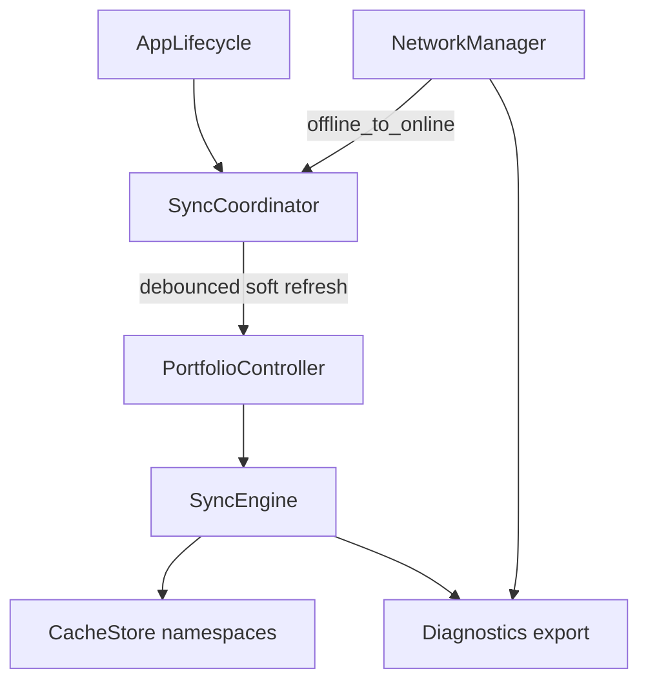

# Sprint 9 Implementation Report

## Summary

Sprint 9 hardens Auvora for production-shaped reliability without new consumer feature chrome: cache-first startup, a lifecycle-aware SyncCoordinator, partial per-chain sync with capped retries, namespaced local cache, developer diagnostics, and web offline/retry parity — all preview-honest (no fake multi-region / million-user claims).

## Locked decisions

- No new consumer feature screens — harden home, portfolio, engine, settings, web3-adjacent paths
- Preview-first honesty for balances and health probes
- Client-first; reuse existing gateway circuits / Alchemy retries / `@auvora/resilience` on services
- Diagnostics = developer/support only
- Notifications stay local (Sprint 8); no FCM reliability work

## Architecture refinements

## What shipped

### Mobile

- **Cache-first home:** paint `cachedPortfolio()` before RPC; soft refresh keeps figures visible
- **Splash:** cosmetic delay cut from ~480ms to ~80ms; `coldStartMs` recorded into diagnostics
- **SyncCoordinator:** debounce, coalesce in-flight, pause on background, resume + offline→online refresh; respects `walletDisplay.autoRefresh`
- **Partial sync:** per-chain try/catch keeps last-good holdings; `failedChains` + syncDelayed banners
- **`withRetry`:** capped exponential backoff for ping / balance / history / prices (never for send/sign)
- **NetworkManager:** dual DNS probe, ping retry + degraded backup miss, `forceOffline` for tests
- **CacheStore:** namespaced TTL cache (portfolio, tx-history, network-meta) + legacy key migration
- **Diagnostics screen** (Settings → Diagnostics): sync age, counters, endpoints, export JSON, clear cache — no secrets
- **Home banners:** cached age labels, partial-chain failure copy, soft syncing state

### Web

- Portfolio reads offline cache first; refreshes on `online` / reconnect
- `withGetRetry` + `apiGetWithRetry` for idempotent GETs only
- Advanced settings: real `/health` probe with capped retries + clear offline cache
- Expanded offline cache namespaces + `clearOfflineCache`

## Performance / reliability gains

| Area         | Before                           | After                                     |
| ------------ | -------------------------------- | ----------------------------------------- |
| Startup feel | Fixed ~480ms splash + blank load | ~80ms settle + cached portfolio paint     |
| Sync         | Manual / pull only               | Debounced coordinator + reconnect refresh |
| Chain outage | Entire load can fail             | Partial sync + last-good chain holdings   |
| Retries      | None on client reads             | Capped 2–3 attempts with backoff          |
| Offline      | Cache if lucky                   | Explicit cache-first + age labels         |
| Diagnostics  | Counters unused                  | Exportable developer surface              |

## Verification

- `flutter test test/reliability_test.dart` — retry caps, cache SWR, partial sync, offline cache read
- `flutter test test/wallet_engine_test.dart test/portfolio_test.dart` — regression smoke
- Web `jest src/lib/reliability/get-retry.test.ts`
- Web `tsc --noEmit`
- `dart analyze` on Sprint 9 paths

## Council hardening applied

- Stale balances always labeled with age / from-cache / failed chains
- Retries never wrap mutating send/sign
- Diagnostics never export keys, seeds, or PINs
- Health probe failures stay honest (no multi-region success fiction)
- Soft refresh avoids blanking the UI (battery-friendlier than thrashing full reloads)
- Auto-refresh respects user preference

## Known limitations (not blockers for Sprint 9 approval)

- Preview adapters — balances are not live chain truth yet
- No PWA service worker / full offline SPA shell
- No million-user load test as a deliverable this sprint
- SyncEngine provider recreation can reset in-memory diagnostics across rare rebuilds (session-scoped)
- Web portfolio still demo holdings behind cache envelope until live balance APIs land

## Remaining work before AI integration

- Live RPC balance path with the same partial-sync + retry contracts
- Persist SyncCoordinator metrics across provider rebuilds
- Optional WorkManager / background fetch policy (battery budget)
- Wire `apiGetWithRetry` into remaining authenticated dashboard fetches
- Production RUM / cold-start SLOs once live endpoints exist

## Approval

Sprint 9 meets the reliability bar for a **preview-first production-shaped client**: feels faster, recovers from partial and offline failure, labels accuracy honestly, and exposes support diagnostics without claiming infra that is not yet live.
