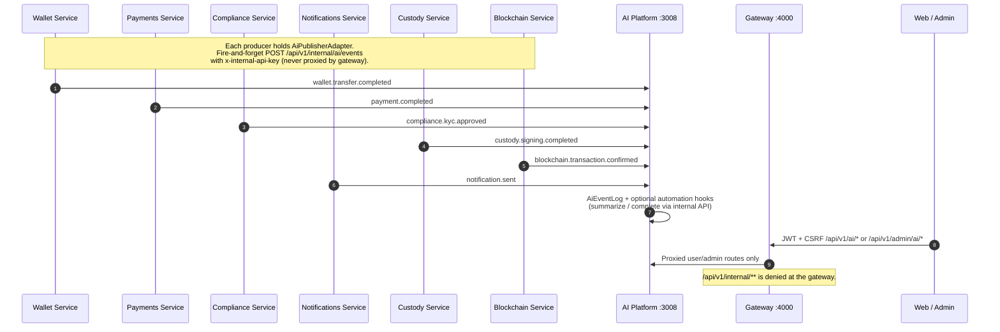
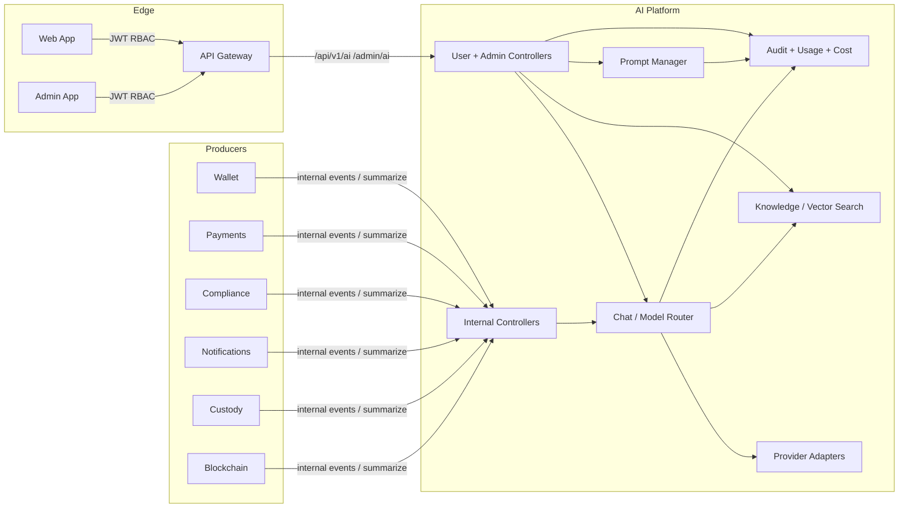

# AI Platform — System Interaction Diagram

How Wallet, Payments, Compliance, Notifications, and the AI Platform communicate through well-defined HTTP interfaces (no in-process cross-service imports).

## Sequence (domain events → AI)

## Component interfaces

## Interface contracts

| From | To | Contract |
|------|----|----------|
| Web/Admin | Gateway → AI | REST `/api/v1/ai/*`, `/api/v1/admin/ai/*` + JWT + permission codes `ai:*` |
| Domain services | AI | REST `/api/v1/internal/ai/events\|complete\|summarize` + `x-internal-api-key` |
| AI | LLM vendors | Provider ports (OpenAI/Anthropic/Gemini/Azure/Local/Simulator) via env credentials |
| AI | Postgres/Redis | Prisma models + Redis response cache |

No service imports another service's Nest modules or domain packages across boundaries.
