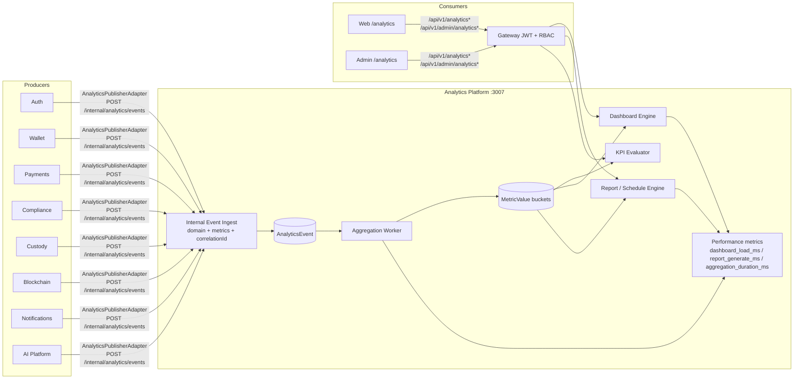

# Analytics Data Flow

How platform modules publish into the Analytics pipeline and how data reaches dashboards and reports.

## Contract

Every producer must send:

| Field | Required | Notes |
|-------|----------|-------|
| `eventType` | yes | e.g. `wallet.transfer.completed` |
| `domain` | yes | `AUTH`, `WALLET`, `PAYMENTS`, … |
| `payload` | yes | opaque JSON |
| `metrics` | optional | map of `MetricDefinition.code` → numeric delta |
| `sourceService` | recommended | defaults per adapter |
| `correlationId` | recommended | tracing |

## Scheduled reports

Failures stay `ACTIVE` with exponential backoff (`nextAttemptAt`) until `maxAttempts`, then `FAILED`. Success resets attempts and advances `nextRunAt`.
