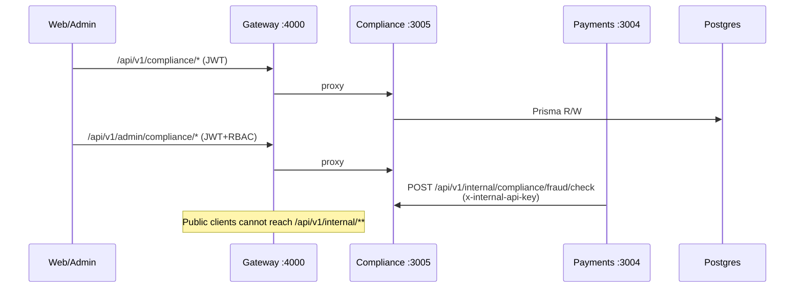

# Workspace Dependency Graph

Generated during Phase 6 architecture integrity verification (2026-07-25). Edges are `workspace:*` package dependencies only — runtime HTTP calls between services are shown separately.

## Package / service dependency (workspace)

```mermaid
flowchart TB
  subgraph apps [Apps]
    web["@auvora/web"]
    admin["@auvora/admin"]
    docsApp["@auvora/docs"]
  end

  subgraph services [Services]
    gateway["@auvora/gateway-service"]
    auth["@auvora/auth-service"]
    wallet["@auvora/wallet-service"]
    blockchain["@auvora/blockchain-service"]
    payments["@auvora/payments-service"]
    compliance["@auvora/compliance-service"]
    custody["@auvora/custody-service"]
    notifications["@auvora/notifications-service"]
    analytics["@auvora/analytics-service"]
    ai["@auvora/ai-service"]
  end

  subgraph packages [Shared packages]
    sdk["@auvora/sdk"]
    ui["@auvora/ui"]
    types["@auvora/types"]
    security["@auvora/security"]
    database["@auvora/database"]
    schema["@auvora/database-schema"]
    config["@auvora/config"]
  end

  web --> sdk
  web --> types
  web --> ui
  admin --> sdk
  admin --> types
  admin --> ui
  docsApp --> sdk
  docsApp --> types
  docsApp --> ui

  sdk --> types
  security --> types
  database --> schema

  gateway --> database
  gateway --> security
  gateway --> types
  auth --> database
  auth --> security
  auth --> types
  wallet --> database
  wallet --> security
  wallet --> types
  blockchain --> database
  blockchain --> security
  blockchain --> types
  payments --> database
  payments --> security
  payments --> types
  compliance --> database
  compliance --> security
  compliance --> types
  custody --> database
  custody --> security
  custody --> types
  notifications --> database
  notifications --> security
  notifications --> types
  analytics --> database
  analytics --> security
  analytics --> types
  ai --> database
  ai --> security
  ai --> types

  types -.-> config
  ui -.-> config
  sdk -.-> config
  security -.-> config
  database -.-> config
```

**Boundary rules enforced:** no service→service package imports; apps never import `@auvora/database` or other services; packages never import apps/services.

## Runtime HTTP integration (Phase 6)

## Cycles

Workspace dependency cycles: **none**.  
Sampled relative TypeScript import cycles (compliance, payments, gateway, sdk, types, database): **none**.
