# Workspace Dependency Graph

Updated during code-quality audit (2026-07-26). Edges are `workspace:*` package dependencies only — **runtime HTTP calls between services** are documented in [`runtime-service-dependency-graph.md`](./runtime-service-dependency-graph.md).

## Package / service dependency (workspace)

```mermaid
flowchart TB
  subgraph apps [Apps]
    web["@auvora/web"]
    admin["@auvora/admin"]
    docsApp["@auvora/docs"]
  end

  subgraph services [Services]
    gateway["@auvora/gateway-service"]
    auth["@auvora/auth-service"]
    wallet["@auvora/wallet-service"]
    blockchain["@auvora/blockchain-service"]
    payments["@auvora/payments-service"]
    compliance["@auvora/compliance-service"]
    custody["@auvora/custody-service"]
    notifications["@auvora/notifications-service"]
    analytics["@auvora/analytics-service"]
    ai["@auvora/ai-service"]
    observability["@auvora/observability-service"]
  end

  subgraph packages [Shared packages]
    sdk["@auvora/sdk"]
    ui["@auvora/ui"]
    types["@auvora/types"]
    security["@auvora/security"]
    database["@auvora/database"]
    schema["@auvora/database-schema"]
    config["@auvora/config"]
    resilience["@auvora/resilience"]
    cache["@auvora/cache"]
    secrets["@auvora/secrets"]
  end

  web --> sdk
  web --> types
  web --> ui
  admin --> sdk
  admin --> types
  admin --> ui
  docsApp --> types
  docsApp --> ui

  gateway --> types
  gateway --> security
  gateway --> database
  gateway --> resilience
  auth --> types
  auth --> security
  auth --> database
  wallet --> types
  wallet --> security
  wallet --> database
  blockchain --> types
  blockchain --> security
  blockchain --> database
  payments --> types
  payments --> security
  payments --> database
  compliance --> types
  compliance --> security
  compliance --> database
  custody --> types
  custody --> security
  custody --> database
  notifications --> types
  notifications --> security
  notifications --> database
  analytics --> types
  analytics --> security
  analytics --> database
  ai --> types
  ai --> security
  ai --> database
  observability --> types
  observability --> security
  observability --> database

  sdk --> types
  ui --> types
  security --> types
  database --> schema
  database --> types
  secrets --> types
  cache --> types
  resilience --> types
  config --> types
```

## Notes

- `@auvora/cache` and `@auvora/secrets` are published workspace packages with limited runtime adoption (Phase 13 / 12 foundations). Wiring into domain services is tracked debt.
- `@auvora/docs` intentionally does **not** depend on `@auvora/sdk`.
- For scale/resilience topology see [`scalability-resilience-topology.md`](./scalability-resilience-topology.md).
