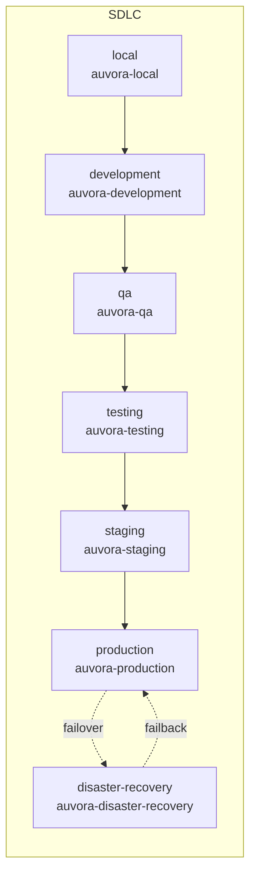

# Deployment Environments

| Environment | Namespace | Helm values | Secrets |
|-------------|-----------|-------------|---------|
| local | `auvora-local` | `values-local.yaml` | Chart Secret (`create: true`) — local only |
| development | `auvora-development` | `values-development.yaml` | External Secrets |
| qa | `auvora-qa` | `values-qa.yaml` | External Secrets |
| testing | `auvora-testing` | `values-testing.yaml` | External Secrets |
| staging | `auvora-staging` | `values-staging.yaml` | External Secrets |
| production | `auvora-production` | `values-production.yaml` | External Secrets |
| disaster-recovery | `auvora-disaster-recovery` | `values-disaster-recovery.yaml` | External Secrets (DR replica) |

Isolation rules: separate namespaces, secret remote keys, image tags, and ingress hosts. No shared credentials across environments.
