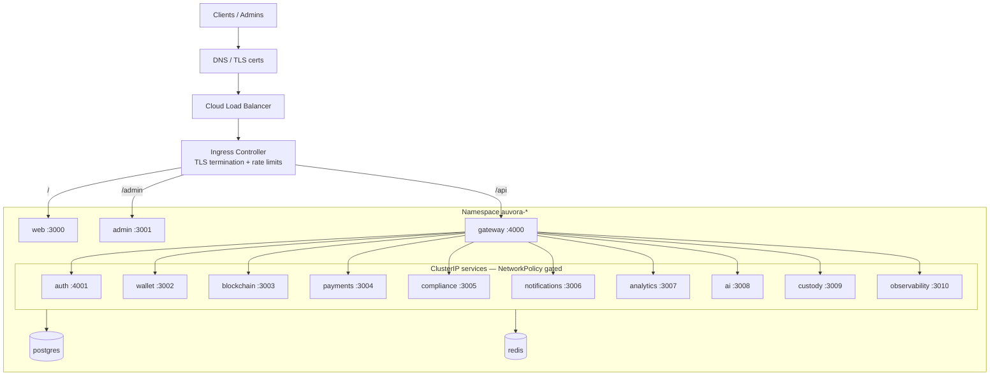

# Networking Topology

## Segmentation

- **Edge:** only `gateway`, `web`, `admin` accept Ingress traffic.
- **East-west:** domain services allow ingress from `gateway` pods only (NetworkPolicy).
- **Data plane:** Postgres/Redis are ClusterIP; no public exposure.
- **Rate limiting:** Ingress annotations (`limit-rps`, `limit-connections`).
- **TLS:** terminated at Ingress; optional mTLS via mesh in future without chart rewrite.
