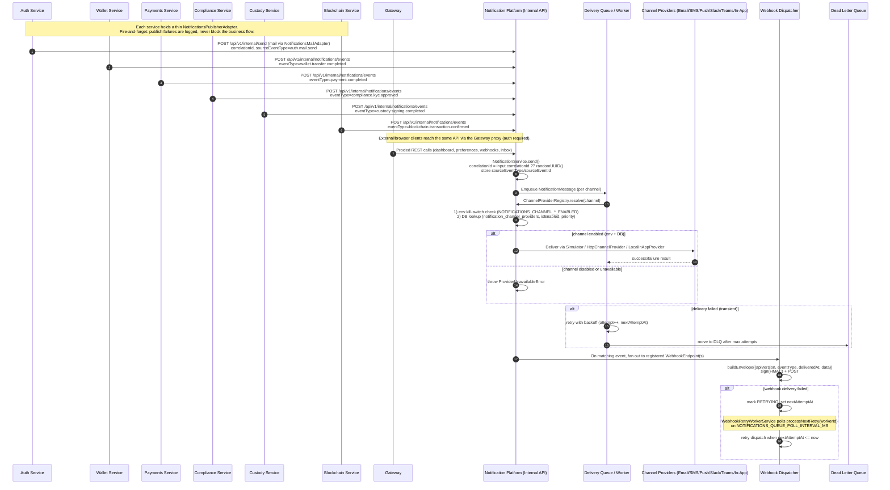
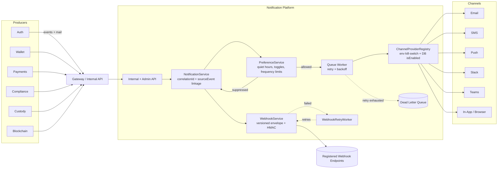

# Notification Communication Flow

This document illustrates how domain services (Auth, Wallet, Blockchain, Payments,
Compliance, Custody) publish events into the Notification Platform, and how the
platform fans those events out to channels, webhooks, the delivery queue, and the
dead-letter queue (DLQ).

## Cross-service event flow (sequence)

## High-level component flow

## Key production-readiness properties

- **Channel enable/disable without code changes**: an operator can flip
  `notification_channel_providers.isEnabled` via the admin API
  (`POST /providers/:id/enable|disable`), or hard-disable a channel with an
  `NOTIFICATIONS_CHANNEL_*_ENABLED=false` env flag (checked first).
- **Traceability**: every `NotificationMessage` has a `correlationId` (generated if not
  supplied by the caller) and optional `sourceEventType`/`sourceEventId`, indexed for
  fast lookup and cross-service tracing.
- **Resilience**: notification delivery and webhook delivery both have independent
  retry-with-backoff loops and DLQ semantics; a downstream outage never blocks the
  originating business transaction because publishers are fire-and-forget.
- **Webhook versioning**: payloads are wrapped in a versioned envelope
  (`{apiVersion, eventType, deliveredAt, data}`) before signing, so consumers can
  evolve independently of the platform's internal payload shape.
