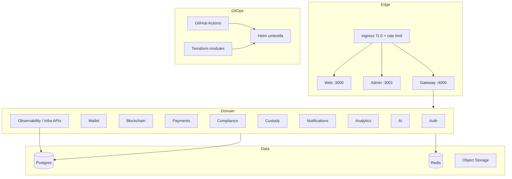

# Production Infrastructure — Architecture Overview

```mermaid
flowchart TB
  subgraph Edge
    ING[Ingress TLS + rate limit]
    WEB[Web :3000]
    ADM[Admin :3001]
    GW[Gateway :4000]
  end

  subgraph Domain
    AUTH[Auth]
    WAL[Wallet]
    BC[Blockchain]
    PAY[Payments]
    CMP[Compliance]
    CUS[Custody]
    NTF[Notifications]
    AN[Analytics]
    AI[AI]
    OBS[Observability / Infra APIs]
  end

  subgraph Data
    PG[(Postgres)]
    RD[(Redis)]
    OBJ[Object Storage]
  end

  subgraph GitOps
    TF[Terraform modules]
    HELM[Helm umbrella]
    GHA[GitHub Actions]
  end

  ING --> WEB
  ING --> ADM
  ING --> GW
  GW --> Domain
  Domain --> PG
  Domain --> RD
  OBS --> PG
  GHA --> HELM
  TF --> HELM
```

Environments: `local` · `development` · `qa` · `testing` · `staging` · `production` · `disaster-recovery` (namespace-isolated).
