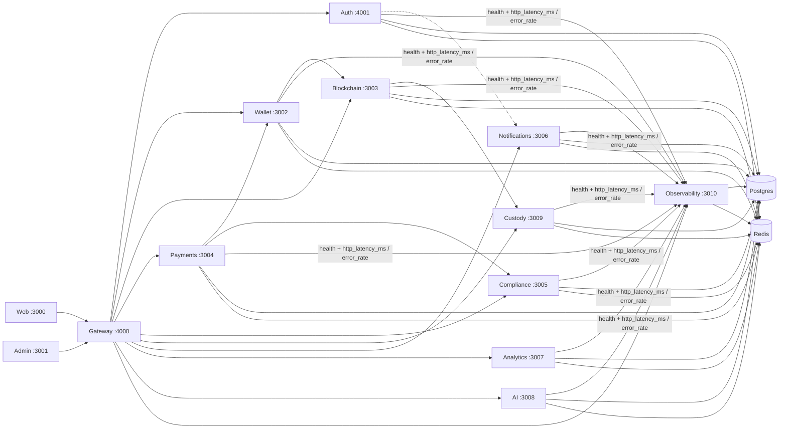

# Runtime Service Dependency Graph

Operational dependency map for the Auvora Wallet platform (Phase 11 Observability). Edges mirror seeded `ObsServiceDependency` rows and gateway proxy routes. Source of truth at runtime: `GET /api/v1/admin/observability/dependencies`.

## Trace / correlation propagation

Gateway `hardenProxyRequest` forwards `traceparent`, `tracestate`, `x-correlation-id`, and `x-request-id` on every proxied hop. Each Nest service applies `RequestContextMiddleware` so structured logs and metric samples carry the same correlation ID.
