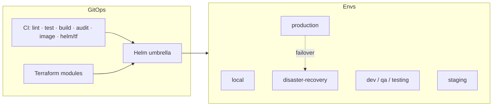

# Scalability, Resilience & Deployment Topology

Last updated: **2026-07-26** (Enterprise Readiness Verification)

## Scalability & resilience

```mermaid
flowchart TB
  Clients[Clients / Admin / Automations]
  GW[API Gateway<br/>rate limit · proxy timeout 30s<br/>security headers · /metrics/resilience]

  subgraph EdgeScale[Horizontally scalable edge]
    WEB[Web]
    ADM[Admin]
    GW
  end

  subgraph DomainScale[Stateless domain services + HPA]
    AUTH[Auth]
    WAL[Wallet]
    BC[Blockchain]
    PAY[Payments]
    CMP[Compliance]
    NTF[Notifications + queue workers]
    AI[AI + request cache]
    AN[Analytics + aggregation]
    OBS[Observability + alerts]
    CUS[Custody]
  end

  subgraph ResilienceLibs[Shared libraries]
    R[@auvora/resilience<br/>timeout · retry · circuit · bulkhead]
    C[@auvora/cache<br/>TTL · invalidation · hit ratio]
  end

  subgraph Data[Data plane]
    PG[(Postgres pooled)]
    RD[(Redis)]
  end

  Clients --> WEB & ADM & GW
  GW --> DomainScale
  DomainScale --> PG & RD
  DomainScale -.uses.-> R & C
  AI --> C
  NTF --> R
```

## Deployment topology (multi-env)



## Failure signaling

| Signal | Where |
|--------|-------|
| Readiness `degraded` | Gateway `/ready` when auth/deps fail |
| Upstream timeouts / circuit | Proxy timeouts; `/metrics/resilience` |
| Alerts / incidents / SLOs | Observability service + Admin `/observability` |
| Public status | Web `/status` |
| Rate limiting | `X-RateLimit-*` / HTTP 429 |
| Logs | Structured pino logs with correlation IDs |

## Related diagrams

- Environments: [`deployment-environments.md`](./deployment-environments.md)
- Networking: [`networking-topology.md`](./networking-topology.md)
- Service inventory: [`service-topology.md`](./service-topology.md)
- Production infra overview: [`production-infrastructure.md`](./production-infrastructure.md)
