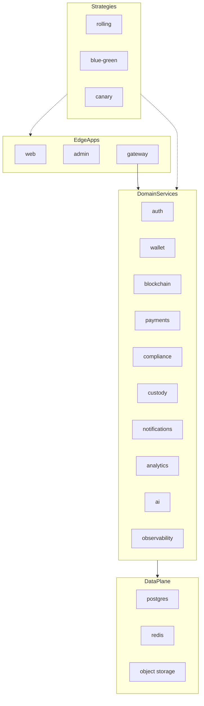

# Service Topology & Deployability

Every deployable unit is rendered by the Helm umbrella chart `infrastructure/helm/auvora-wallet` and backed by Terraform modules for cloud resources.

## Deployable inventory

| Unit | Kind | Port | Helm path | Image |
|------|------|------|-----------|-------|
| gateway | Deployment | 4000 | `services.gateway` | `gateway-service` |
| auth | Deployment | 4001 | `services.auth` | `auth-service` |
| wallet | Deployment | 3002 | `services.wallet` | `wallet-service` |
| blockchain | Deployment | 3003 | `services.blockchain` | `blockchain-service` |
| payments | Deployment | 3004 | `services.payments` | `payments-service` |
| compliance | Deployment | 3005 | `services.compliance` | `compliance-service` |
| notifications | Deployment | 3006 | `services.notifications` | `notifications-service` |
| analytics | Deployment | 3007 | `services.analytics` | `analytics-service` |
| ai | Deployment | 3008 | `services.ai` | `ai-service` |
| custody | Deployment | 3009 | `services.custody` | `custody-service` |
| observability | Deployment | 3010 | `services.observability` | `observability-service` |
| web | Deployment | 3000 | `apps.web` | `web` |
| admin | Deployment | 3001 | `apps.admin` | `admin` |
| postgres | StatefulSet | 5432 | `postgres` (optional in-cluster) | `postgres:16-alpine` |
| redis | Deployment | 6379 | `redis` (optional in-cluster) | `redis:7-alpine` |

## Deployment strategies

| Strategy | Helm `global.deploymentStrategy` | Behavior |
|----------|----------------------------------|----------|
| Rolling | `rolling` | `maxUnavailable: 0`, `maxSurge: 1`; pods labeled `auvora.io/track=stable` |
| Blue/Green | `blue-green` | Release deploys to `global.blueGreen.slot`; Service selects `activeSlot` for cutover |
| Canary | `canary` | Stable Deployment + `{name}-canary` Deployment/Service for progressive traffic |

Probes on all app/service containers: **startup**, **liveness**, **readiness**. Security context: **runAsNonRoot** (+ dropped capabilities).
